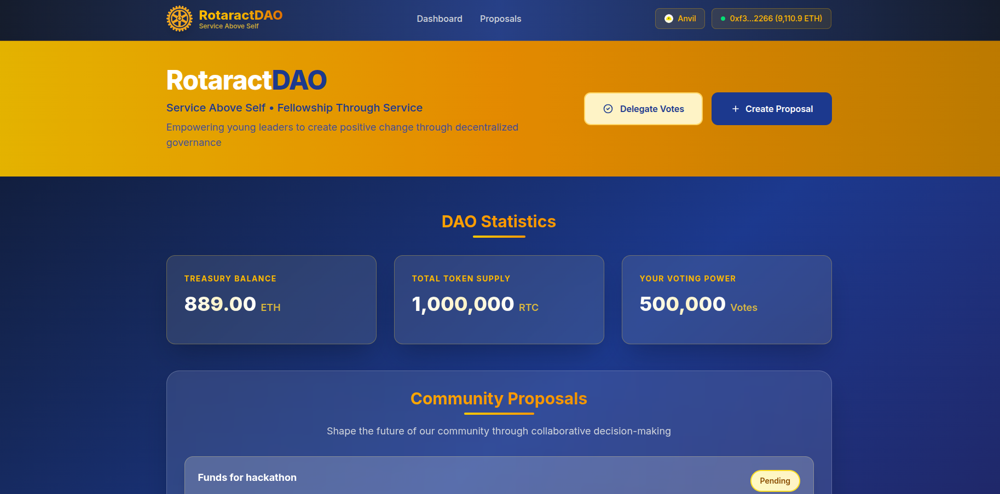

# RotaractDAO

A decentralized autonomous organization (DAO) reimagining the traditional Rotaract Club model through blockchain technology. RotaractDAO introduces full transparency in fund management by leveraging a community treasury governed by smart contracts. Members can submit proposals, vote on initiatives, and automatically receive approved funds via secure on-chain transactions: eliminating opacity and enabling trustless coordination.

## Key Features
- Blockchain-based community treasury
- Proposal and voting mechanism
- Smart contract-driven fund disbursement
- Transparent, decentralized governance for community clubs

# Prerequisites
- foundry
- npm
- crypto-wallet (ex: Metamask)

# Getting started
## Basic setup
First clone the repository
```bash
git clone https://github.com/CjSidharth/rotaract-dao.git
```
Then change to foundry directory and install packages using the following commands:
```bash
cd foundry
forge install OpenZeppelin/openzeppelin-contracts
forge install Cyfrin/foundry-devops
forge install smartcontractkit/chainlink-evm                 
```
Change to frontend directory and install packages:
```bash
cd frontend
npm install
```


## Starting local node and Deploying
```bash
cd foundry
anvil
```
Create keystore wallet for quick testing and name it Anvil_1.
Take a private key from anvil and give a password.
```bash
cast wallet import Anvil_1
```
In another terminal instance, deploy the contracts:
```bash
make deploy-anvil-dao
```
Lastly go to frontend folder and run dev server:
```bash
npm run dev
```

## Workflow:
- Click on the delegate votes to convert RTC to voting power
- Click on create proposal and fill the form.
- Then to activate the proposal, fastforward time by 201 blocks:
```bash
cast rpc anvil_mine 201
```
- Then after voting, finish the time period by:
```bash
cast rpc anvil_mine 201
```
- Queue the proposal and execute it after 2 seconds.

# TODO
- Audit it after learning security auditing
- Optimize for gas efficiency
- Deploy to Sepolia Testnet

